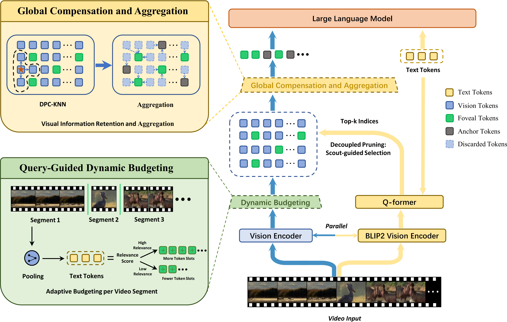

# [ACL 2026] Vista-LLM: Decoupled Query-Guided Visual Token Pruning for Efficient Long-Video Large Language Models

<!-- [](https://arxiv.org/abs/xxxx.xxxx) -->

[](https://opensource.org/licenses/MIT)

Vista-LLM is a decoupled, query-guided visual token pruning framework for long-video LLMs that reduces token consumption by 90% while retaining over 98% performance.



## News

- **[2026.04.15]**: Our model and local inference code are available!
- **[2026.04.06]**: 🎉 Our paper has been accepted by ACL 2026!

## 🛠️ Installation

1. Clone this repository:

```bash
git clone https://github.com/lizhenyu-123/Vista-LLM.git
cd Vista-LLM
```

2. Create a virtual environment and install dependencies:

```bash
conda create -n vista-llm python=3.10.18
conda activate vista-llm

# Install PyTorch
pip install torch==2.7.0 torchvision==0.22.0  --index-url https://download.pytorch.org/whl/cu128

# Install LLaVA-NeXT (Required only if you use LLaVA family models)
git clone https://github.com/LLaVA-VL/LLaVA-NeXT
cd LLaVA-NeXT
pip install -e .
cd ..

# Install other requirements
pip install -r requirements.txt
```

## 📂 Data & Weights Preparation

### 1. Pre-trained Weights

We provide the fine-tuned BLIP-2 weights on Hugging Face. Please download the weights and place them in the specified directory and modify the path in the configuration file:

- 🤗 **[Hugging Face: Fine-tuned BLIP-2 Weights](https://huggingface.co/zy125885/Vista-LLM-BLIP2)**

### 2. Data Preprocessing

Our evaluation is based on the following four public video datasets. Please download them from the official links:

- [Video-MME](https://huggingface.co/datasets/lmms-lab/Video-MME)
- [MVBench](https://huggingface.co/datasets/OpenGVLab/MVBench)
- [MLVU](https://huggingface.co/datasets/MLVU/MVLU)
- [LongVideoBench](https://huggingface.co/datasets/longvideobench/LongVideoBench)

After downloading the raw videos, run the following script to extract frames for preprocessing:

```bash
python extract_frames.py \
    --video-root /path/to/your/raw_videos \
    --output-root /path/to/save/extracted_frames \
    --n-frames 64
```

## 🚀 Inference & Evaluation

As a decoupled and plug-and-play framework that requires no modifications to the LLM's attention mechanism, Vista-LLM currently supports the following mainstream Video-LLMs seamlessly:

- **LLaVA Family**: LLaVA-Video, LLaVA-OneVision
- **Qwen Family**: Qwen2.5-VL

Before inference, please ensure you have completed the data preprocessing in the previous section and downloaded our fine-tuned BLIP-2 weights.

### 1. Inference

> **⚠️ Note:** The following commands use the **Video-MME** dataset as an example. Before running, please make sure to open the corresponding `.sh` scripts and modify the parameters to match your local environment.

**For LLaVA-Video and LLaVA-OneVision:**

```bash
bash LLava/script/run_experiment_videomme.sh
```

**For Qwen2.5-VL:**

```bash
bash  Qwen/script/run_experiment_videomme.sh
```

### 2. Evaluation

After generating the predictions, run the following evaluation script to calculate the final scores for various benchmarks:

```bash
bash utils/evaluate_all.bash
```

## 🏋️ Fine-tuning (Optional)

We also provide the source code for fine-tuning the BLIP-2 Q-Former (Semantic Scout) used in Vista-LLM. If you are interested in reproducing our training process or fine-tuning the scout module on your own datasets, please refer to the corresponding code and scripts in the repository.

<!-- ## 📖 Citation

To be released -->

<!-- If you find our code or paper helpful for your research, please cite:

```bibtex
@article{vista_llm_2026,
  title={Vista-LLM: Decoupled Query-Guided Visual Token Pruning for Efficient Long-Video Large Language Models},
  author={Author A and Author B and Author C},
  journal={arXiv preprint arXiv:xxxx.xxxx},
  year={2026}
}
``` -->
